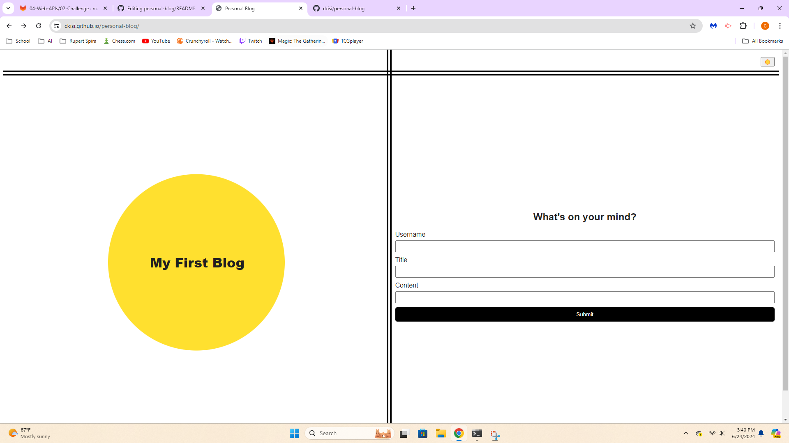
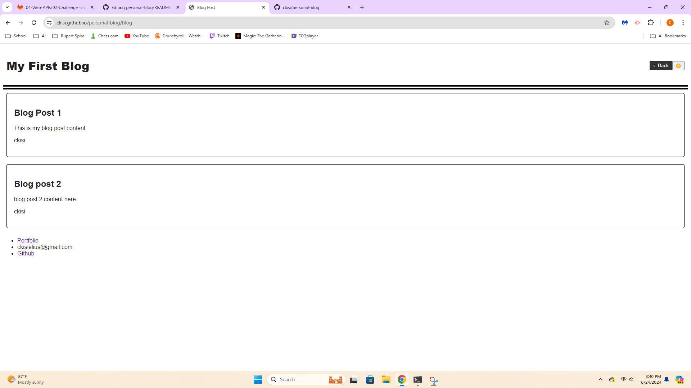

# Personal Blog

## Description
This is a blog for marketing students to record and showcase their personal thoughts and experiences. It utilizes JavaScript to record the inputs that are submited in the form on the front page. It logs the blog posts to local storage so you can access previous posts when you revisit the site.

## Usage
Fill out all three of the input fields and click submit. What you inputed will be displayed on the page you are redirected to. Clicking the sun symbol in the top right corner will allow you to change the website's theme from light mode to dark mode and vice versa. Clicking the back button will bring you back to the form page where you can submit another post.

## Technologies
HTML, CSS, JavaScript

## Links
https://ckisi.github.io/personal-blog/
https://github.com/ckisi/personal-blog

## Screenshots

## Credits
Xpert Learning Assistant: for help with the dark mode JavaScript
